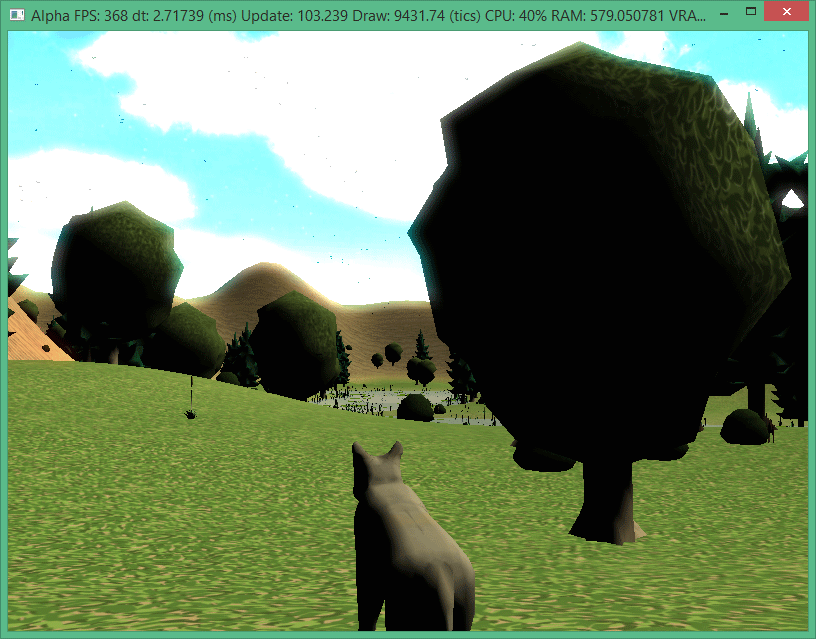
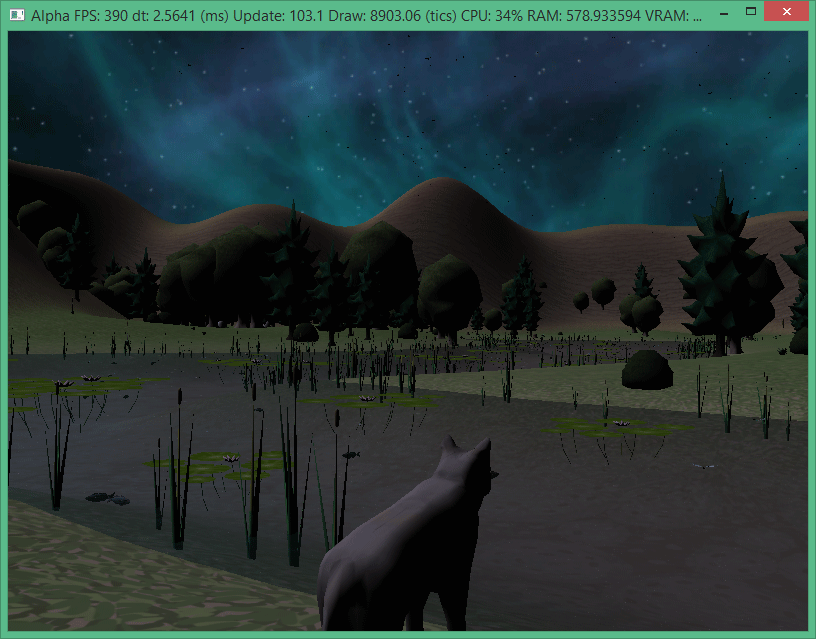
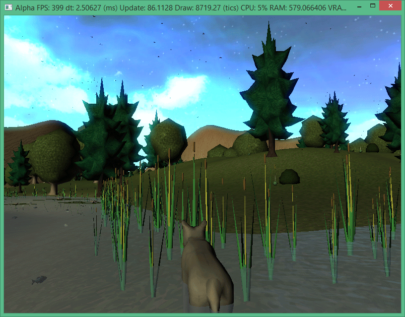
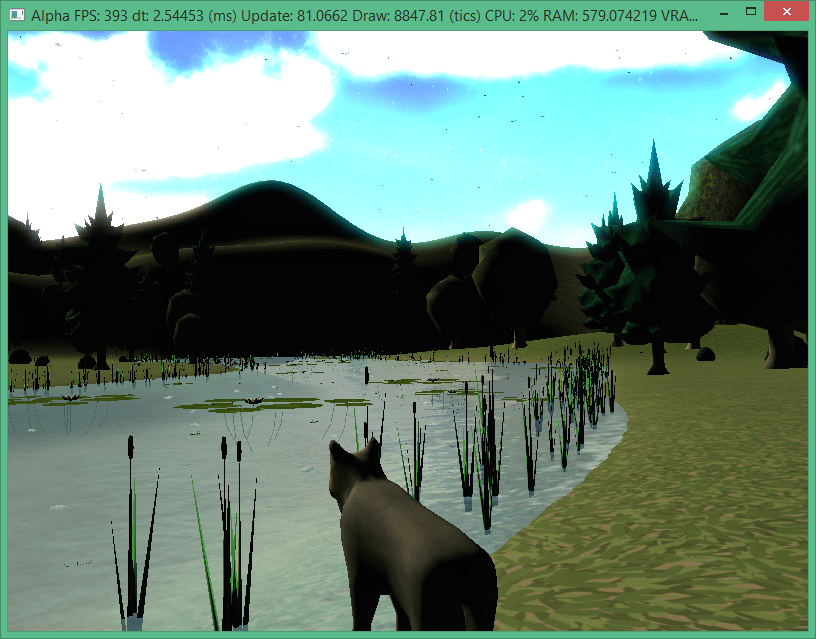
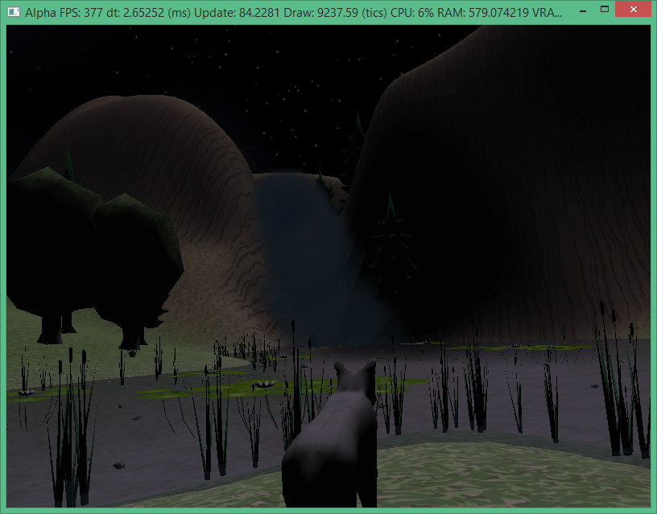
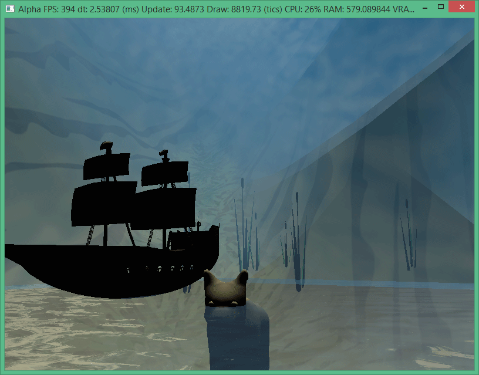
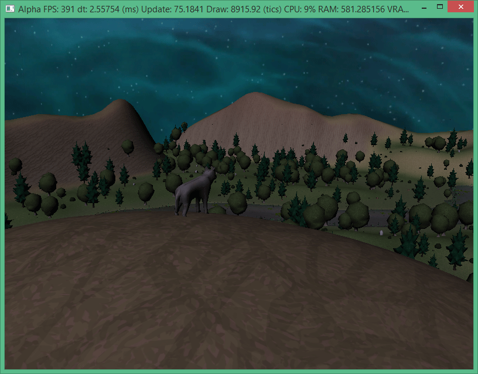

Alpha was a semester long project written in C++ using the DirectX11 graphics API. As a game Alpha focused more on the experience and less on mechanics. The player assumed the role of a wolf, exploring a small box canyon.

While the game looks nice, it's not a very game like experience. This is primarily due to the fact that we became bogged down in the graphical elements as opposed to the gameplay design and implementation. 
That being said the project was a success in that it exposed myself and my team to game engine and graphics programming.

- Terrain Rendering
- User Controls
- Git repo management

[owl-carousel items=2 margin=10 loop=true autoplay=true autoplayHoverPause=true merge=true lazyLoad=true nav=true]

[/owl-carousel]