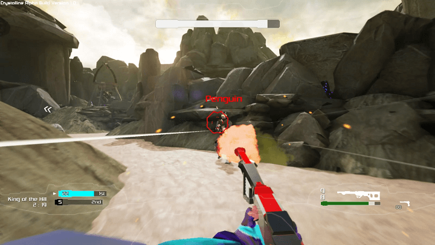
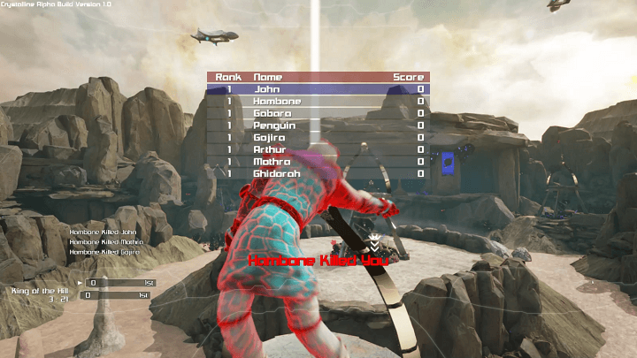

A multiplayer First Person Shooter developed in Unreal Engine 4.5. Crystalline, while being largely an
FPS, incorporates elements of MOBA and RTS games to enhance gameplay with strategic choices. 

I acted as the Chief Gameplay Engineer, handled networking, ui and variety of other "glue tasks" to 
ensure the product shipped on time.

- Weapon Design and Development
- Game Mode Design
- Technical Research (engines, physics, etc.)
- Networking
- GUI
- General Programming.

[owl-carousel items=2 margin=10 loop=true autoplay=true autoplayHoverPause=true merge=true lazyLoad=true nav=true]

[/owl-carousel]