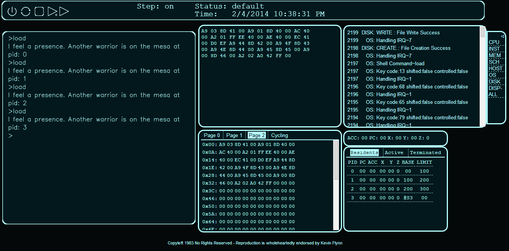
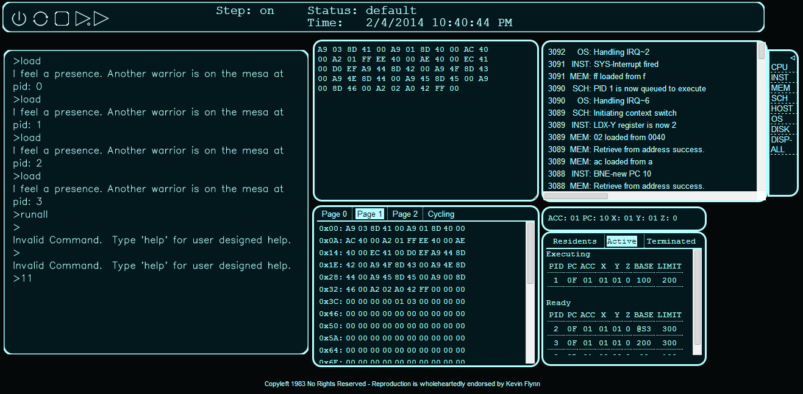
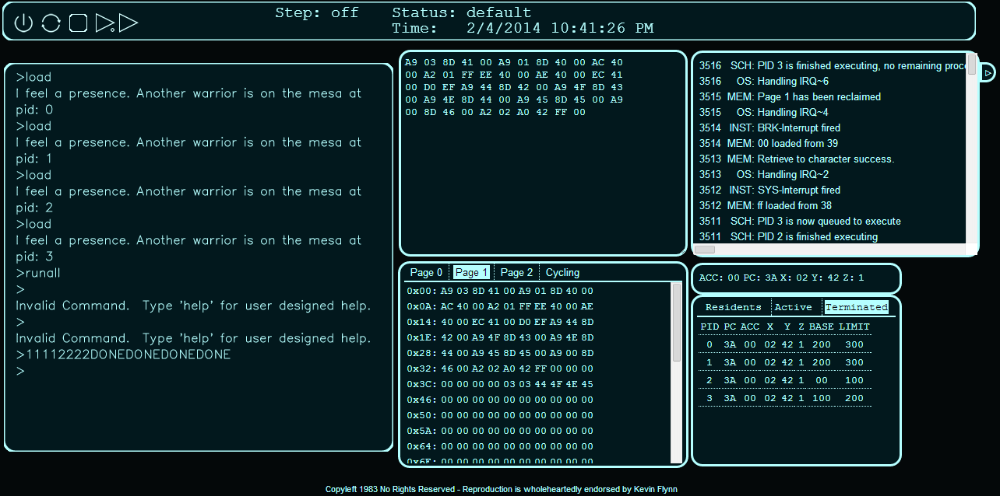

An operating system written in JavaScript built upon a virtual 6502. 

I created this for a senior year Operating Systems course in my at Marist College. The Virtual 6502 and a bare-bones console were supplied to us, all scheduling, virtual 6502 instructions, memory and storage was written by me.

- UI
- Scheduling (round robin, FCFS, and priority)
- File System
- Memory 

[owl-carousel items=1 margin=10 loop=true autoplay=true autoplayHoverPause=true merge=true lazyLoad=true nav=true]

[/owl-carousel]
