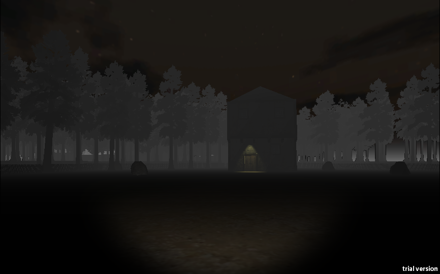
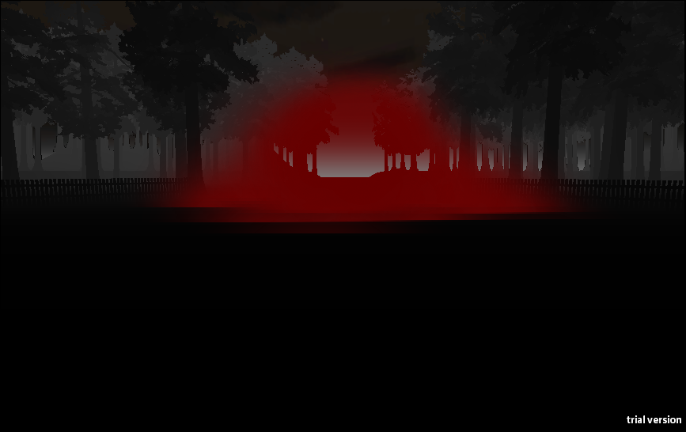
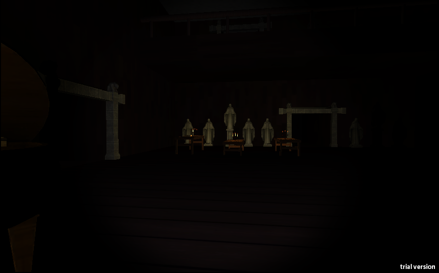
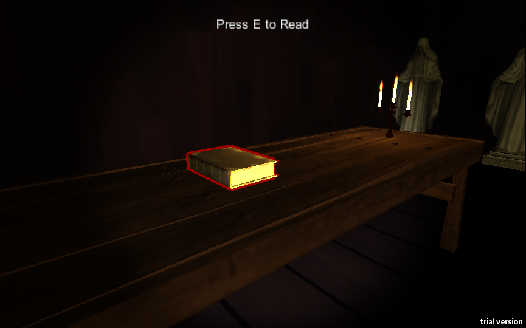
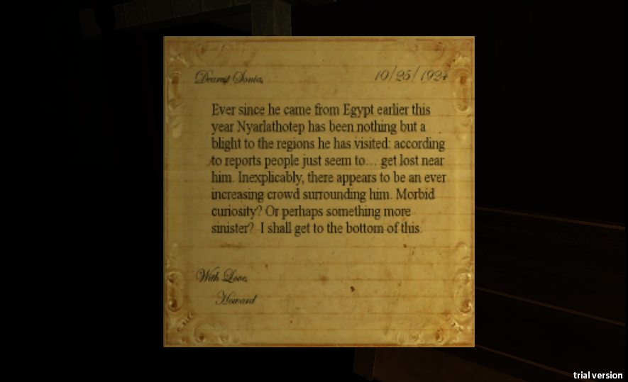

Created with the prompt to create a prototype based on a public domain work, with our group electing to create a horror game based on the works of H.P. Lovecraft. T
he gameplay is roughly inspired by **Gone Home*, but with an attempt to place horror at the forefront. The player must wander a house in search of several books that unveil the games story while progressively going insane.

This game was definitely over scoped for the time frame we had allotted to complete the project, but it served as a valuable lesson in how to best scope a prototype (read: what not to do). This game also featured the Oculus Rift in one version, 
but due to merge issues this version was rendered unplayable.

- Level layout (originally designed for non-euclidean space, a lost feature).
- Teleportation Mechanic. 
- Oculus Rift Integration (dropped due to lack of time).

[owl-carousel items=2 margin=10 loop=true autoplay=true autoplayHoverPause=true merge=true lazyLoad=true nav=true]

[/owl-carousel]