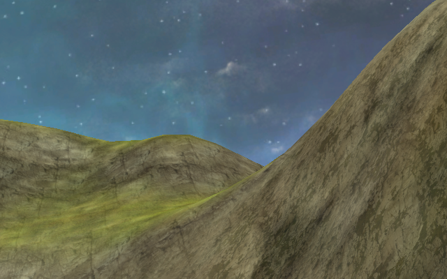
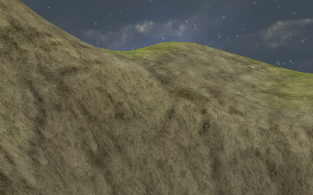

Upon finishing JohnGen I was somewhat disappointed in the lack of variety in the actual terrain. Most of the terrain was mountains and lakes, which is fine for fjords, but not terribly varied. 
Additionally, I wanted to play with GPGPU technologies in the form of DirectX 11's Compute Shaders.

The choice to move to DirectX 11 was driven by the fact that I was working on Alpha and had taken on the role of Terrain programmer. As a result I had a test bed to play with DirectX 11's compute shaders.

To generate the noise for the terrain features I used a two pass approach. The first defined the overall topography of the terrain (e.g. mountains, plains, oceans) and the second defined local detail, making the terrain surface look interesting. Both passes used simplex noise to 
generate the features in a compute shader which was stored to a texture on the GPU. Simplex noise was used as I had familiarity with it, and based on my tests and experiments I found it to produce the most interesting noise.

While I found JohnGen 2.0 to be a success it did have some flaws. It was less interesting to look at when compared to JohnGen. Not because of the terrain shape, but rather due to the fact that I didn't have a system in place for terrain details such as trees. 
Additionally, the rendering fell apart at a distance, something that was a given in Unity. Finally, while it looks good JohnGen 2.0 did not have collision detection and wasn't designed to interact with a physics engine.

If I were to revisit JohnGen 2.0 I would likely focus my efforts on three areas: render distances, collision detection, and less naive tessellation.

- Wrote Compute Shaders to perform simplex noise.
- Wrote Tessellation Shaders for actual rendering.
- Configured noise input to generate "interesting" features and variation

[owl-carousel items=2 margin=10 loop=true autoplay=true autoplayHoverPause=true merge=true lazyLoad=true nav=true]

[/owl-carousel]