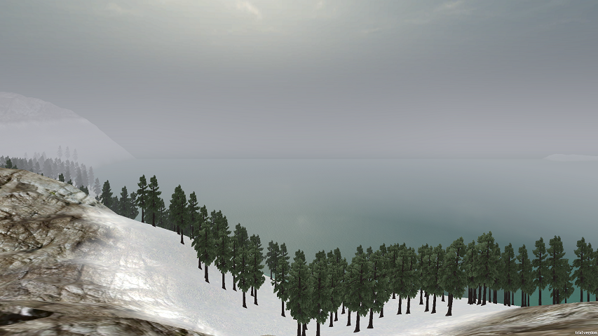
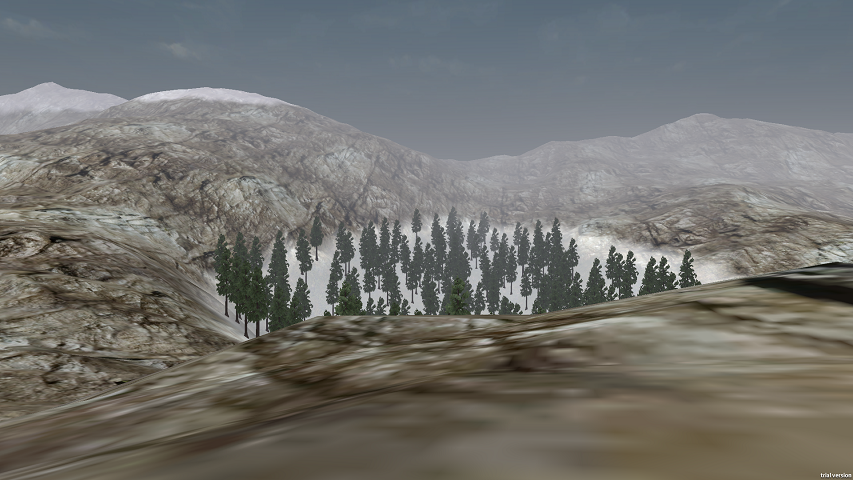
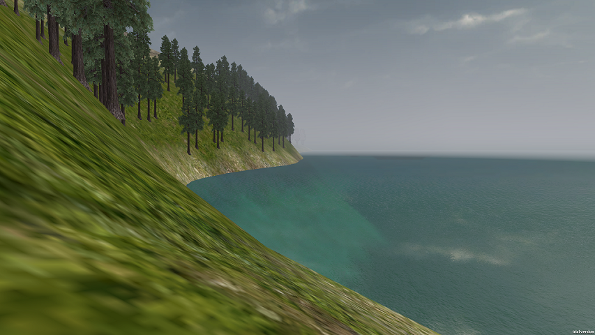

Designed and implemented for my AI in game environments course JohnGen is a terrain generator that leverages Unity3d's built in terrain system. The terrain generator was created over the course of one month, utilizing a variety of noise generation, combination and optimization techniques.

When the player begins to play level they are dropped into the center of the currently rendered map. The map in question consists of 49 unique unity terrain objects tiled seven wide by seven deep measuring in at 400 by 400 units a piece. As the player navigates the map these 
tiles are reused and shifted in an effort to reduce garbage collection calls and general memory usage. Seven terrain objects  at 400 units was selected as I found it hid the "pop in" effect well when a bit of fog was added to the scene to emulate atmospheric conditions.

In terms of generating the terrain I employed two algorithms: Simplex Noise and Diamond Square. Simplex Noise was initially selected for its ability to perform higher dimensional noise generation, however, I quickly found this was out of the scope for the project so I abandoned this 
approach in relatively short order. Simplex Noise remained after this realization chiefly because I had gotten it working with my terrain system. Simplex Noise is the primary noise function for most aspects of this environment.

Diamond Square was selected for the interesting patterns it created and its speed, which didn't slow the runtime to a crawl like voronoi. That being said getting it to tile with simplex took some doing (as the two are inherently not tileable out of the box with one another). 
I found a workaround in ensuring that edges were deterministically similar to their neighbors with the Midpoint Displacement algorithm. It must be noted that this produces ridges (a known drawback to Diamond Square).

For terrain the two noise algorithms were averaged with a weight towards Simplex Noise as I preferred the rolling hills it produced to Diamond Square's ragged mountain ranges. Not content with the terrain alone I added a somewhat faked biome system modeled after a Whittaker Diagram: 
Biomes could be hot or cold based on a simplex driven temperature and could exist somewhere on the scale of ocean to mountain based on a simplex driven humidity value. Hot/cold would drop a snow texture on the splat if it were cold and the humidity would directly affect the combination for the height map.

To finish it all out I scattered trees, dropped in a water table and added fog ultimately to make what I consider an awesome environment.

- Employed a variety of noise generation techniques to create interesting terrain and environments.
- Leveraged Unity3d's built in terrain objects.
- Learned how to use coroutines in a unity context.

[owl-carousel items=2 margin=10 loop=true autoplay=true autoplayHoverPause=true merge=true lazyLoad=true nav=true]

[/owl-carousel]