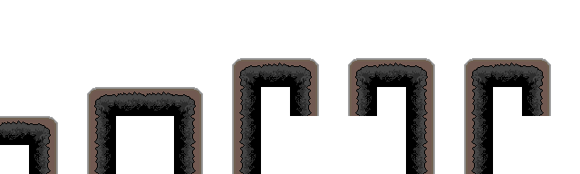
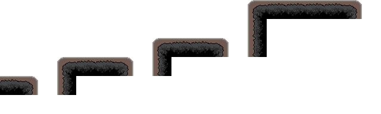
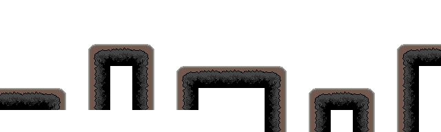
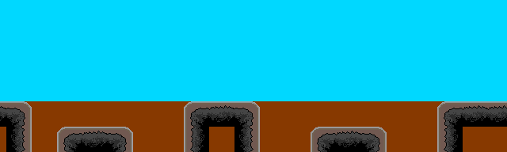
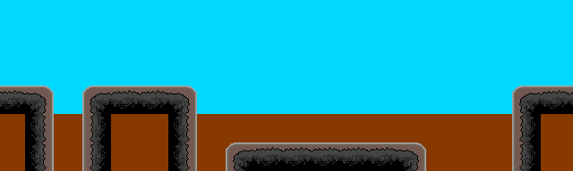
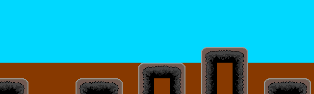

The fruits of an independent study this is an XML specified procedural generation tool. Originally this was designed to work with Breaking Out and create a traversable game map. 
The underlying algorithm for Maptals is the Drunkard's walk, as I found it was the simplest manner in which to ensure that the map was at least theoretically traversable. 
The XML specification is used to absolutely ensure that the game world would be traversable, as it was programmer defined. With the XML the Algorithm produces a numeric array that represents a tile map for an associated tile sheet. 
Additionally, any possible objects are be generated and kept track of. After creating the map it is then converted to the tiled map file type for easy engine consumption.

Maptals has been tested in Breaking Out and was capable of making game worlds measuring in at least 6 by 500 hundred tiles in a matter of seconds.

- Implemented a directed variation of the Drunkard's Walk.
- Specified an XML format for map creation.
- Wrote a Tiled .tmx file type exporter.

[owl-carousel items=2 margin=10 loop=true autoplay=true autoplayHoverPause=true merge=true lazyLoad=true nav=true]

[/owl-carousel]