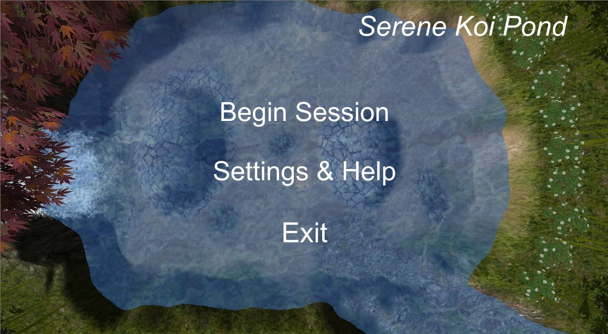
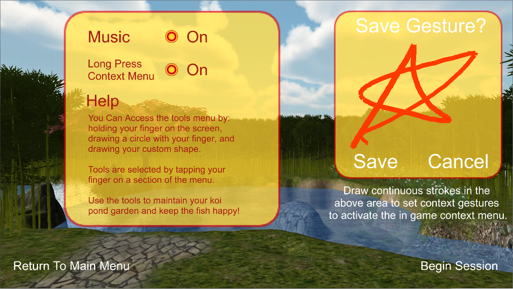
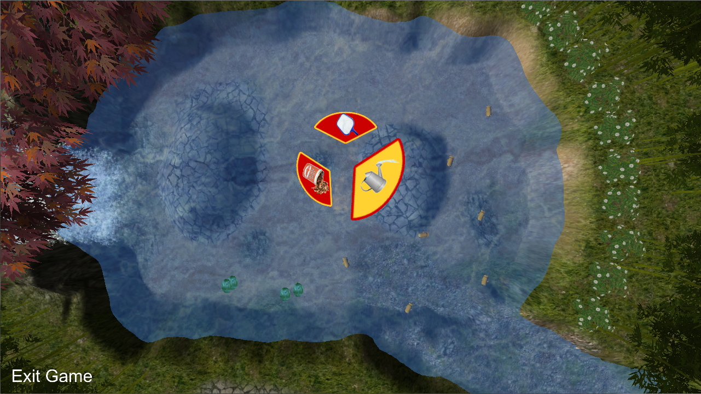
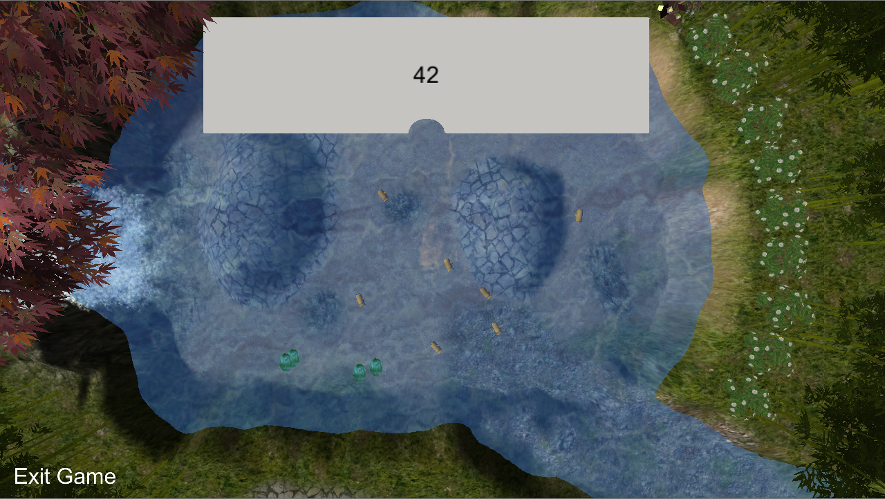

This prototype was created with the goal of helping rehabilitate people undergoing physical therapy. The setting is a picturesque Koi Pond with soft, calming music and the sound of a small waterfall. 
All of these components seek to calm the player as they undergo what is likely a very stressful time in their life. The player is given three tools (a skimmer, fish food and a watering can)that they can switch between by drawing either a circle or another shape set by  
modifiable broad gesture recognition (the recognition code was modified from the  (unity wiki)[http://wiki.unity3d.com/index.php?title=Gesture_Recognizer]). We offer no explanation for how to use any of the tools, as the prototype focuses more on being a 
toy than an explicit game.

The game was targeted for the Microsoft Pixelsense to take advantage of the large touch area, which was of great value for the sake of rehabilitation. Touch was "faked" using mouse clicks as my team and I had limited access to devices that could develop multi-touch for the Pixelsense.

- Level design (polished by Nick)
- GUI and menu systems
- Gesture recognition tweaking
- Sound effects (music was found by Bryan) 
- General "glue" work

[owl-carousel items=1 margin=10 loop=true autoplay=true autoplayHoverPause=true merge=true lazyLoad=true nav=true]

[/owl-carousel]
